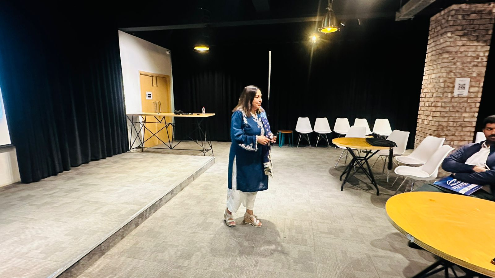

# 🌊 BlueNet+ | Maritime Stakeholders Hub (MSH)


> **Pakistan’s First Digital Ecosystem for the Blue Economy.** > *Connect. Empower. Transform.*

---

## 📖 Table of Contents
- [🌟 Project Overview](#-project-overview)
- [🚀 Key Features](#-key-features)
- [💻 Tech Stack](#-tech-stack)
- [🛠️ Installation & Setup](#%EF%B8%8F-installation--setup)
- [📸 Screenshots](#-screenshots)
- [🤝 Contributing](#-contributing)

---

## 🌟 Project Overview

**BlueNet+ (MSH)** is a unified digital platform designed to link government, industry, academia, and coastal communities. It addresses the fragmentation in Pakistan's maritime sector by providing a single hub for data, services, skills, and innovation.

### 🎯 Core Mission
To foster **data-driven decision-making**, connect stakeholders to **tech solutions**, and promote **youth & women empowerment** in the Blue Economy.

---

## 🚀 Key Features

### 1️⃣ 🌀 Digital Maritime Membership Platform
A professional network for verified stakeholders.
- **Role-based Access:** Government, Industry, Academia, Startups.
- **Verification System:** Ensures credibility and trust.

### 2️⃣ 🛠️ Maritime Services Marketplace
The "Fiverr" for the ocean economy.
- **Services:** Hydrographic surveys, diving, marine engineering, legal advisory.
- **Features:** Provider profiles, service listings, and booking requests.

### 3️⃣ 📊 Ocean Data & Research Hub
Bridging the gap between science and policy.
- **offerings:** National knowledge repository, marine data access, and research matchmaking.

### 4️⃣ 🎓 Blue Skills Academy ("HarvestWise")
Capacity building for the future workforce.
- **Tracks:** Blue Tech, Science, Governance, and Business.
- **Focus:** Youth & women leadership programs.

### 5️⃣ 💼 Incubator for Ocean Startups
Accelerating blue innovation.
- **Support:** Mentorship, funding access, and technical labs.
- **Themes:** Smart fisheries, seaweed economy, renewable marine energy.

---

## 💻 Tech Stack

This project is built with a modern, high-performance stack:

| Category | Technology |
|----------|------------|
| **Frontend** |    |
| **Styling** |   |
| **Backend** |  (PostgreSQL + Auth) |
| **Icons** |  |
| **Deployment** |  |

---

## 🛠️ Installation & Setup

Follow these steps to run the project locally:

1.  **Clone the Repository**
    ```bash
    git clone [https://github.com/Raazia-Imran/BlueNetPlus.git](https://github.com/Raazia-Imran/BlueNetPlus.git)
    cd BlueNetPlus
    ```

2.  **Install Dependencies**
    ```bash
    npm install
    ```

3.  **Set Up Environment Variables**
    Create a `.env` file in the root directory and add your Supabase credentials:
    ```env
    VITE_SUPABASE_URL=your_supabase_url
    VITE_SUPABASE_ANON_KEY=your_supabase_anon_key
    ```

4.  **Run the Development Server**
    ```bash
    npm run dev
    ```

---

## 📸 Screenshots

| Landing Page | Marketplace |
|:---:|:---:|
|  |  |

---

## 🤝 Contributing

We welcome contributions! Please see our [CONTRIBUTING.md](CONTRIBUTING.md) for details.

---

<p align="center">
  Developed with 💙 by <strong>Raazia Imran & Zohaib</strong> & <strong>BlueNet+ Team</strong>
</p>
